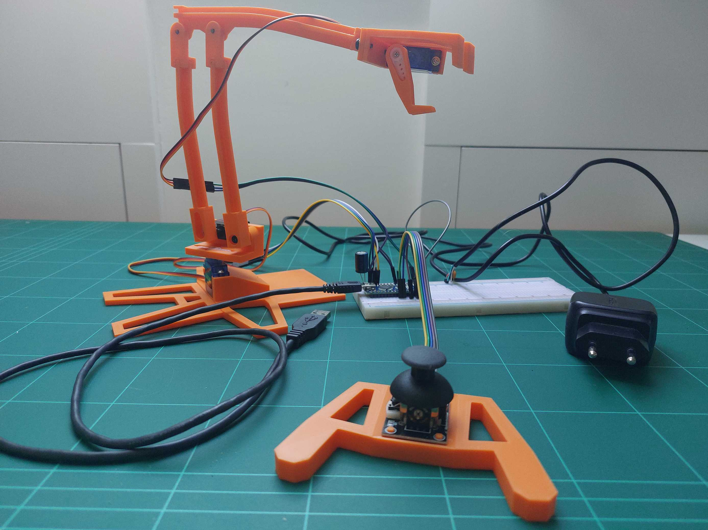

# CoderDojo
Some educational things I use for CoderDojo sessions. More info https://coderdojobelgium.be/.

## bot_gears_arm_joystick
A small, low cost, 3D printable robot arm ([Credits 3D model](https://projecthub.arduino.cc/bzqp/super-bot-gears-a-3d-printed-arduino-starter-kit-6d6613)). This arm has only 3 DOF (Dimension of Freedom). This drawback compared to 4 or more DOF is an advantage here since 3 servo motors are easier to keep track of in the code ...

The code is suited for Dutch speaking kids, but I guess it is easy to translate to whatever language you prefer.

For references, license, guidance and advice, read the source code [bot_gears_arm_joystick.ino](./bot_gears_arm_joystick/bot_gears_arm_joystick.ino).

